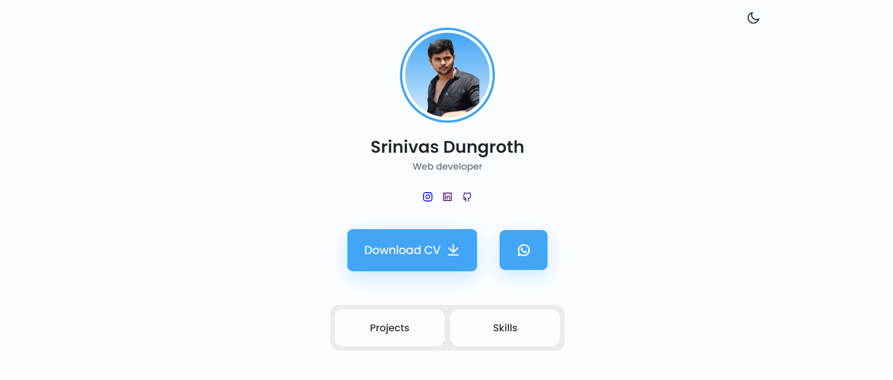

# Web-portfolio
Personal Portfolio Welcome to my personal portfolio! This project showcases my skills, projects, and experiences in web development using HTML, CSS, and JavaScript.

Features
Responsive Design: Optimized for various devices and screen sizes.
Interactive UI: Engaging and interactive user interface using modern JavaScript.
Project Showcase: Display of my projects with descriptions and live demos.
Contact Form: Functional contact form for reaching out.
Smooth Animations: Subtle animations and transitions for a pleasant user experience.
Technologies Used
HTML5: For structuring the content.
CSS3: For styling and layout.
Flexbox & Grid: Used for layout design.
Animations & Transitions: For interactive elements.
JavaScript (ES6+): For interactivity and dynamic content.
DOM Manipulation: For dynamic content updates.
Form Validation: For validating user input in the contact form.

Usage
Home Page: Introduction and navigation to other sections.
About Me: Information about my background and skills.
Projects: Detailed descriptions of my projects with links to live demos and source code.
Contact: Form to send messages directly to my email.

